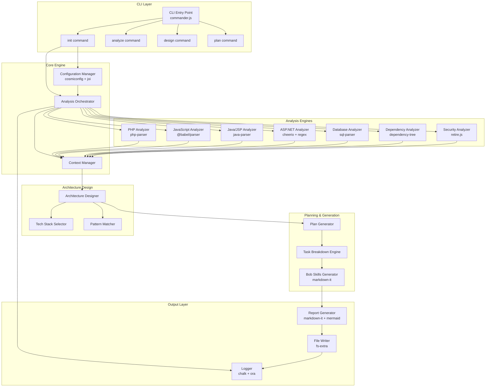
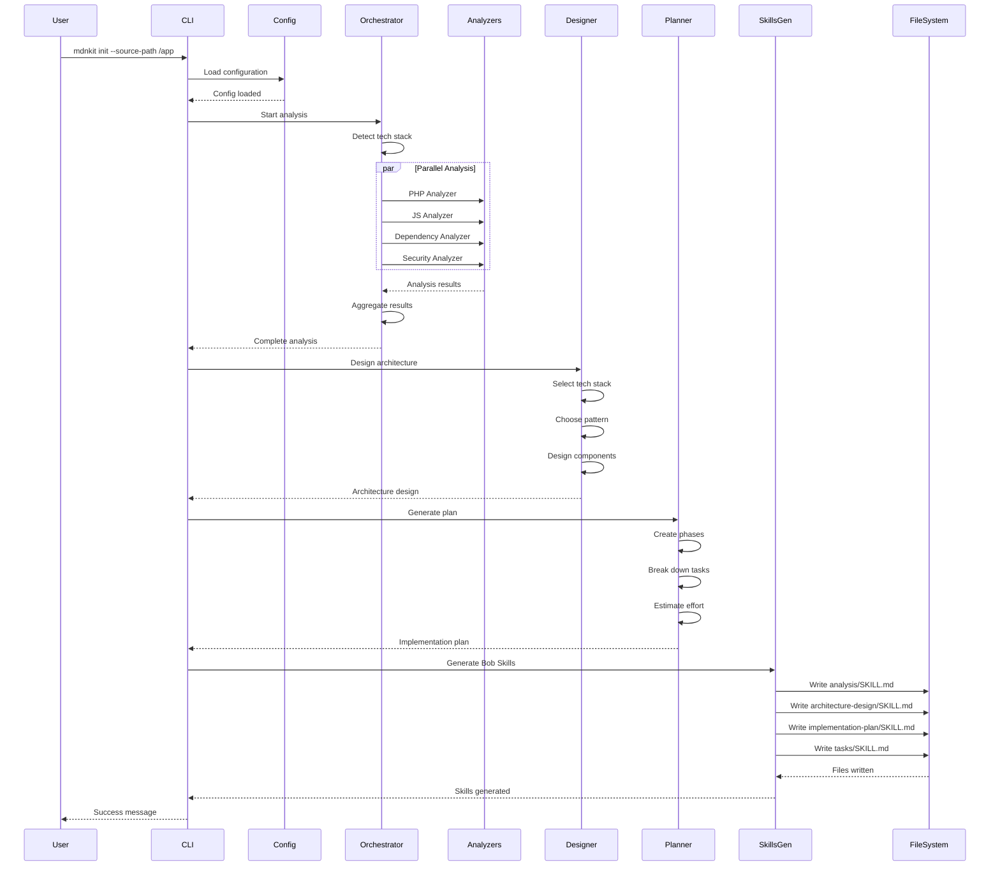

# mdnkit Architecture Design Document

> **Comprehensive architecture design for the mdnkit legacy application modernization toolkit**

**Version**: 1.0  
**Last Updated**: 2026-05-02  
**Status**: Draft for Review

---

## Table of Contents

1. [Executive Summary](#executive-summary)
2. [Technology Stack Selection](#technology-stack-selection)
3. [System Architecture Overview](#system-architecture-overview)
4. [Core Components Design](#core-components-design)
5. [Data Models & Interfaces](#data-models--interfaces)
6. [Module Interactions](#module-interactions)
7. [Implementation Strategy](#implementation-strategy)
8. [Security & Performance Considerations](#security--performance-considerations)

---

## Executive Summary

mdnkit is a CLI-based npm package designed to analyze legacy applications and generate IBM Bob Skills markdown files for AI-driven modernization. The architecture prioritizes:

- **Modularity**: Pluggable analyzers for different legacy technologies
- **Extensibility**: Easy addition of new analysis capabilities and target architectures
- **Performance**: Efficient parsing and analysis of large codebases
- **Reliability**: Robust error handling and validation
- **Developer Experience**: Clear CLI interface with helpful feedback

---

## Technology Stack Selection

### Core Runtime & Language

**Selected: Node.js 18+ with TypeScript**

**Rationale:**
- Native npm ecosystem integration for global CLI distribution
- Excellent file system and process management APIs
- Rich ecosystem of parsing and analysis libraries
- TypeScript provides type safety and better maintainability
- Cross-platform compatibility (Windows, macOS, Linux)
- Strong async/await support for I/O operations

**Alternatives Considered:**
- Python: Great for analysis but npm distribution less natural
- Go: Excellent performance but smaller ecosystem for code parsing
- Rust: Best performance but steeper learning curve and smaller ecosystem

### CLI Framework

**Selected: Commander.js v11+**

**Rationale:**
- Industry standard for Node.js CLI applications
- Excellent argument parsing and validation
- Built-in help generation
- Subcommand support for `init`, `analyze`, `design`, `plan`
- TypeScript support

**Alternatives Considered:**
- Yargs: More complex API, heavier
- Oclif: Over-engineered for our needs
- Inquirer.js: Will use this alongside Commander for interactive prompts

### Code Analysis Libraries

**Selected Multi-Library Approach:**

1. **@babel/parser** (JavaScript/TypeScript/JSX)
   - Industry-standard JavaScript parser
   - Supports modern and legacy JavaScript syntax
   - Plugin system for JSX, TypeScript, Flow

2. **php-parser** (PHP)
   - Pure JavaScript PHP parser
   - Supports PHP 5.x - 8.x
   - AST generation for analysis

3. **java-parser** (Java/JSP)
   - JavaScript-based Java parser
   - Handles JSP embedded code
   - AST-based analysis

4. **cheerio** (HTML/JSP/ASP parsing)
   - jQuery-like API for HTML parsing
   - Fast and lightweight
   - Perfect for extracting embedded code

5. **sql-parser** (SQL/Database)
   - Parse SQL queries from code
   - Identify database operations
   - Schema extraction

**Alternatives Considered:**
- Tree-sitter: Excellent but requires native bindings
- Acorn: Good but less feature-complete than Babel
- Custom parsers: Too much maintenance overhead

### File System & Pattern Matching

**Selected:**
- **fast-glob v3+**: High-performance file globbing
- **ignore**: .gitignore-style pattern matching
- **fs-extra**: Enhanced file system operations

**Rationale:**
- Fast-glob is significantly faster than alternatives
- Ignore provides familiar pattern syntax
- fs-extra adds promise support and utilities

### Dependency Analysis

**Selected:**
- **dependency-tree**: Analyze JavaScript/TypeScript dependencies
- **madge**: Circular dependency detection
- **npm-check-updates**: Check for outdated packages

**Rationale:**
- Proven libraries for dependency analysis
- Support for multiple module systems (CommonJS, ESM)
- Integration with package managers

### Security Scanning

**Selected:**
- **npm audit**: Built-in npm security scanning
- **retire.js**: Detect vulnerable JavaScript libraries
- **eslint-plugin-security**: Static security analysis

**Rationale:**
- Leverage existing security databases
- No external API dependencies
- Fast local scanning

### Report Generation

**Selected:**
- **markdown-it**: Markdown generation and rendering
- **mermaid**: Diagram generation
- **chalk**: Terminal colors and formatting
- **ora**: Elegant terminal spinners
- **cli-table3**: ASCII tables for terminal output

**Rationale:**
- Markdown-it is fast and extensible
- Mermaid provides professional diagrams
- Chalk and ora enhance CLI experience

### Configuration Management

**Selected:**
- **cosmiconfig**: Configuration file discovery
- **joi**: Schema validation
- **dotenv**: Environment variable support

**Rationale:**
- Cosmiconfig supports multiple config formats
- Joi provides robust validation
- Standard configuration patterns

### Testing Framework

**Selected:**
- **Vitest**: Fast unit testing
- **@testing-library**: Component testing utilities
- **mock-fs**: File system mocking

**Rationale:**
- Vitest is faster than Jest with better ESM support
- Testing library provides good utilities
- Mock-fs enables isolated file system testing

### Build & Distribution

**Selected:**
- **tsup**: TypeScript bundler
- **npm**: Package distribution
- **semantic-release**: Automated versioning

**Rationale:**
- tsup is fast and zero-config
- npm is the standard for CLI tools
- semantic-release automates releases

---

## System Architecture Overview

### High-Level Architecture



### Directory Structure

```
mdnkit/
├── src/
│   ├── cli/
│   │   ├── index.ts                 # CLI entry point
│   │   ├── commands/
│   │   │   ├── init.ts              # init command
│   │   │   ├── analyze.ts           # analyze command
│   │   │   ├── design.ts            # design command
│   │   │   └── plan.ts              # plan command
│   │   └── prompts/
│   │       ├── tech-stack.ts        # Interactive tech stack selection
│   │       └── architecture.ts      # Architecture pattern selection
│   │
│   ├── core/
│   │   ├── config/
│   │   │   ├── config-manager.ts    # Configuration loading and validation
│   │   │   ├── schema.ts            # Joi validation schemas
│   │   │   └── defaults.ts          # Default configuration
│   │   ├── orchestrator.ts          # Main analysis orchestrator
│   │   ├── context-manager.ts       # Analysis context management
│   │   └── plugin-system.ts         # Plugin architecture for extensibility
│   │
│   ├── analyzers/
│   │   ├── base/
│   │   │   ├── analyzer.interface.ts    # Base analyzer interface
│   │   │   └── analyzer.abstract.ts     # Abstract analyzer class
│   │   ├── php/
│   │   │   ├── php-analyzer.ts          # PHP code analyzer
│   │   │   ├── php-parser-wrapper.ts    # PHP parser wrapper
│   │   │   └── php-patterns.ts          # PHP pattern detection
│   │   ├── javascript/
│   │   │   ├── js-analyzer.ts           # JavaScript analyzer
│   │   │   ├── babel-wrapper.ts         # Babel parser wrapper
│   │   │   └── framework-detector.ts    # Detect jQuery, Angular, etc.
│   │   ├── java/
│   │   │   ├── java-analyzer.ts         # Java/JSP analyzer
│   │   │   ├── jsp-parser.ts            # JSP parsing
│   │   │   └── servlet-detector.ts      # Servlet pattern detection
│   │   ├── aspnet/
│   │   │   ├── aspnet-analyzer.ts       # ASP.NET analyzer
│   │   │   ├── webforms-parser.ts       # WebForms parsing
│   │   │   └── mvc-detector.ts          # MVC pattern detection
│   │   ├── database/
│   │   │   ├── db-analyzer.ts           # Database analyzer
│   │   │   ├── schema-extractor.ts      # Schema extraction
│   │   │   └── query-analyzer.ts        # SQL query analysis
│   │   ├── dependencies/
│   │   │   ├── dep-analyzer.ts          # Dependency analyzer
│   │   │   ├── package-scanner.ts       # Package.json, composer.json, etc.
│   │   │   └── circular-detector.ts     # Circular dependency detection
│   │   └── security/
│   │       ├── security-analyzer.ts     # Security analyzer
│   │       ├── vulnerability-scanner.ts # Vulnerability scanning
│   │       └── pattern-checker.ts       # Security anti-pattern detection
│   │
│   ├── architecture/
│   │   ├── designer.ts                  # Architecture design orchestrator
│   │   ├── tech-stack/
│   │   │   ├── selector.ts              # Tech stack selection logic
│   │   │   ├── recommendations.ts       # Tech stack recommendations
│   │   │   └── compatibility.ts         # Compatibility checking
│   │   ├── patterns/
│   │   │   ├── microservices.ts         # Microservices pattern
│   │   │   ├── serverless.ts            # Serverless pattern
│   │   │   ├── api-first.ts             # API-first pattern
│   │   │   └── modular-monolith.ts      # Modular monolith pattern
│   │   └── components/
│   │       ├── frontend-design.ts       # Frontend component design
│   │       ├── backend-design.ts        # Backend service design
│   │       └── data-design.ts           # Data layer design
│   │
│   ├── planning/
│   │   ├── plan-generator.ts            # Implementation plan generator
│   │   ├── phase-planner.ts             # Phased migration planning
│   │   ├── risk-analyzer.ts             # Risk analysis and mitigation
│   │   ├── task-breakdown.ts            # Task decomposition
│   │   └── estimation.ts                # Effort estimation
│   │
│   ├── bob-skills/
│   │   ├── generator.ts                 # Bob Skills file generator
│   │   ├── templates/
│   │   │   ├── analysis-skill.ts        # Analysis skill template
│   │   │   ├── architecture-skill.ts    # Architecture skill template
│   │   │   ├── plan-skill.ts            # Plan skill template
│   │   │   └── tasks-skill.ts           # Tasks skill template
│   │   └── formatter.ts                 # Markdown formatting utilities
│   │
│   ├── reporters/
│   │   ├── report-generator.ts          # Main report generator
│   │   ├── markdown-builder.ts          # Markdown document builder
│   │   ├── diagram-generator.ts         # Mermaid diagram generator
│   │   └── formatters/
│   │       ├── console-formatter.ts     # Console output formatting
│   │       └── file-formatter.ts        # File output formatting
│   │
│   ├── utils/
│   │   ├── file-system.ts               # File system utilities
│   │   ├── glob-matcher.ts              # File pattern matching
│   │   ├── logger.ts                    # Logging utilities
│   │   ├── spinner.ts                   # Progress indicators
│   │   └── validators.ts                # Input validation
│   │
│   └── types/
│       ├── analysis.types.ts            # Analysis result types
│       ├── architecture.types.ts        # Architecture design types
│       ├── config.types.ts              # Configuration types
│       └── bob-skills.types.ts          # Bob Skills types
│
├── tests/
│   ├── unit/                            # Unit tests
│   ├── integration/                     # Integration tests
│   └── fixtures/                        # Test fixtures
│
├── templates/                           # File templates
│   └── config/
│       └── mdnkit.config.json           # Default config template
│
├── package.json
├── tsconfig.json
├── tsup.config.ts                       # Build configuration
└── README.md
```

---

## Core Components Design

### 1. CLI Layer

**Purpose**: User interface and command routing

**Key Components:**

#### CLI Entry Point (`src/cli/index.ts`)
```typescript
import { Command } from 'commander';
import { initCommand } from './commands/init';
import { analyzeCommand } from './commands/analyze';
import { designCommand } from './commands/design';
import { planCommand } from './commands/plan';

const program = new Command();

program
  .name('mdnkit')
  .description('AI-Powered Legacy Application Modernization Toolkit')
  .version('1.0.0');

program
  .command('init')
  .description('Initialize mdnkit and analyze legacy application')
  .requiredOption('--source-path <path>', 'Path to legacy application')
  .option('--depth <level>', 'Analysis depth: quick|standard|comprehensive', 'standard')
  .option('--frontend <framework>', 'Target frontend framework')
  .option('--backend <framework>', 'Target backend framework')
  .option('--database <type>', 'Target database type')
  .action(initCommand);

program
  .command('analyze')
  .description('Re-analyze legacy application')
  .requiredOption('--source-path <path>', 'Path to legacy application')
  .action(analyzeCommand);

program
  .command('design')
  .description('Design modern architecture')
  .option('--interactive', 'Interactive mode for tech stack selection')
  .action(designCommand);

program
  .command('plan')
  .description('Generate implementation plan')
  .option('--strategy <type>', 'Migration strategy: phased|big-bang|strangler', 'phased')
  .action(planCommand);

program.parse();
```

#### Interactive Prompts (`src/cli/prompts/tech-stack.ts`)
```typescript
import inquirer from 'inquirer';

export async function promptTechStack() {
  return inquirer.prompt([
    {
      type: 'list',
      name: 'frontend',
      message: 'Select frontend framework:',
      choices: ['React', 'Vue.js', 'Angular', 'Next.js', 'Svelte', 'Other'],
    },
    {
      type: 'list',
      name: 'backend',
      message: 'Select backend framework:',
      choices: ['Node.js/Express', 'Python/Django', 'Python/FastAPI', 'Java/Spring Boot', '.NET Core', 'Go', 'Other'],
    },
    {
      type: 'list',
      name: 'database',
      message: 'Select database:',
      choices: ['PostgreSQL', 'MySQL', 'MongoDB', 'Redis', 'Other'],
    },
    {
      type: 'list',
      name: 'architecture',
      message: 'Select architecture pattern:',
      choices: ['Microservices', 'Serverless', 'API-First', 'Modular Monolith', 'Event-Driven'],
    },
  ]);
}
```

### 2. Configuration Manager

**Purpose**: Load, validate, and manage configuration

**Key Features:**
- Support multiple config formats (JSON, YAML, JS)
- Environment variable overrides
- Schema validation with Joi
- Default configuration fallback

**Implementation (`src/core/config/config-manager.ts`):**
```typescript
import { cosmiconfig } from 'cosmiconfig';
import Joi from 'joi';
import { configSchema } from './schema';
import { defaultConfig } from './defaults';

export class ConfigManager {
  private config: Config | null = null;

  async load(configPath?: string): Promise<Config> {
    const explorer = cosmiconfig('mdnkit');
    
    const result = configPath 
      ? await explorer.load(configPath)
      : await explorer.search();

    const userConfig = result?.config || {};
    const mergedConfig = this.mergeWithDefaults(userConfig);
    
    const { error, value } = configSchema.validate(mergedConfig);
    
    if (error) {
      throw new Error(`Configuration validation failed: ${error.message}`);
    }
    
    this.config = value;
    return this.config;
  }

  private mergeWithDefaults(userConfig: Partial<Config>): Config {
    return {
      ...defaultConfig,
      ...userConfig,
      analysis: {
        ...defaultConfig.analysis,
        ...userConfig.analysis,
      },
      targetArchitecture: {
        ...defaultConfig.targetArchitecture,
        ...userConfig.targetArchitecture,
      },
    };
  }

  get(): Config {
    if (!this.config) {
      throw new Error('Configuration not loaded');
    }
    return this.config;
  }
}
```

### 3. Analysis Orchestrator

**Purpose**: Coordinate all analysis engines and manage analysis workflow

**Key Responsibilities:**
- Detect legacy technology stack
- Route to appropriate analyzers
- Aggregate analysis results
- Manage analysis context
- Handle errors and retries

**Implementation (`src/core/orchestrator.ts`):**
```typescript
import { ContextManager } from './context-manager';
import { PhpAnalyzer } from '../analyzers/php/php-analyzer';
import { JavaScriptAnalyzer } from '../analyzers/javascript/js-analyzer';
import { JavaAnalyzer } from '../analyzers/java/java-analyzer';
import { AspNetAnalyzer } from '../analyzers/aspnet/aspnet-analyzer';
import { DatabaseAnalyzer } from '../analyzers/database/db-analyzer';
import { DependencyAnalyzer } from '../analyzers/dependencies/dep-analyzer';
import { SecurityAnalyzer } from '../analyzers/security/security-analyzer';

export class AnalysisOrchestrator {
  private context: ContextManager;
  private analyzers: Map<string, BaseAnalyzer>;

  constructor(config: Config) {
    this.context = new ContextManager(config);
    this.analyzers = new Map([
      ['php', new PhpAnalyzer(config)],
      ['javascript', new JavaScriptAnalyzer(config)],
      ['java', new JavaAnalyzer(config)],
      ['aspnet', new AspNetAnalyzer(config)],
      ['database', new DatabaseAnalyzer(config)],
      ['dependencies', new DependencyAnalyzer(config)],
      ['security', new SecurityAnalyzer(config)],
    ]);
  }

  async analyze(sourcePath: string): Promise<AnalysisResult> {
    // Detect technology stack
    const techStack = await this.detectTechStack(sourcePath);
    
    // Run relevant analyzers in parallel
    const analyzerPromises = techStack.map(tech => 
      this.runAnalyzer(tech, sourcePath)
    );
    
    // Always run cross-cutting analyzers
    analyzerPromises.push(
      this.runAnalyzer('dependencies', sourcePath),
      this.runAnalyzer('security', sourcePath)
    );
    
    const results = await Promise.all(analyzerPromises);
    
    // Aggregate results
    return this.context.aggregate(results);
  }

  private async detectTechStack(sourcePath: string): Promise<string[]> {
    const detectedTech: string[] = [];
    
    // Check for PHP files
    if (await this.hasFiles(sourcePath, '**/*.php')) {
      detectedTech.push('php');
    }
    
    // Check for Java/JSP files
    if (await this.hasFiles(sourcePath, '**/*.{java,jsp}')) {
      detectedTech.push('java');
    }
    
    // Check for ASP.NET files
    if (await this.hasFiles(sourcePath, '**/*.{aspx,cshtml,cs}')) {
      detectedTech.push('aspnet');
    }
    
    // Check for JavaScript files
    if (await this.hasFiles(sourcePath, '**/*.{js,jsx,ts,tsx}')) {
      detectedTech.push('javascript');
    }
    
    return detectedTech;
  }

  private async runAnalyzer(type: string, sourcePath: string): Promise<AnalyzerResult> {
    const analyzer = this.analyzers.get(type);
    if (!analyzer) {
      throw new Error(`Analyzer not found: ${type}`);
    }
    
    return analyzer.analyze(sourcePath);
  }

  private async hasFiles(basePath: string, pattern: string): Promise<boolean> {
    const glob = require('fast-glob');
    const files = await glob(pattern, { cwd: basePath, absolute: false });
    return files.length > 0;
  }
}
```

### 4. Base Analyzer Interface

**Purpose**: Define common interface for all analyzers

**Implementation (`src/analyzers/base/analyzer.interface.ts`):**
```typescript
export interface IAnalyzer {
  analyze(sourcePath: string): Promise<AnalyzerResult>;
  getName(): string;
  getSupportedExtensions(): string[];
}

export abstract class BaseAnalyzer implements IAnalyzer {
  protected config: Config;
  protected logger: Logger;

  constructor(config: Config) {
    this.config = config;
    this.logger = new Logger(this.getName());
  }

  abstract analyze(sourcePath: string): Promise<AnalyzerResult>;
  abstract getName(): string;
  abstract getSupportedExtensions(): string[];

  protected async scanFiles(sourcePath: string): Promise<string[]> {
    const glob = require('fast-glob');
    const extensions = this.getSupportedExtensions();
    const pattern = `**/*.{${extensions.join(',')}}`;
    
    return glob(pattern, {
      cwd: sourcePath,
      absolute: true,
      ignore: ['**/node_modules/**', '**/vendor/**', '**/dist/**', '**/build/**'],
    });
  }

  protected async readFile(filePath: string): Promise<string> {
    const fs = require('fs-extra');
    return fs.readFile(filePath, 'utf-8');
  }
}
```

### 5. PHP Analyzer Example

**Purpose**: Analyze PHP legacy applications

**Implementation (`src/analyzers/php/php-analyzer.ts`):**
```typescript
import { BaseAnalyzer } from '../base/analyzer.abstract';
import { parse } from 'php-parser';

export class PhpAnalyzer extends BaseAnalyzer {
  private parser: any;

  constructor(config: Config) {
    super(config);
    this.parser = parse({
      parser: {
        php7: true,
        php8: true,
      },
    });
  }

  getName(): string {
    return 'PHP Analyzer';
  }

  getSupportedExtensions(): string[] {
    return ['php'];
  }

  async analyze(sourcePath: string): Promise<AnalyzerResult> {
    this.logger.info('Starting PHP analysis...');
    
    const files = await this.scanFiles(sourcePath);
    const results: PhpAnalysisResult = {
      files: [],
      classes: [],
      functions: [],
      dependencies: [],
      patterns: [],
      issues: [],
    };

    for (const file of files) {
      const content = await this.readFile(file);
      const ast = this.parser.parseCode(content, file);
      
      // Extract classes
      const classes = this.extractClasses(ast);
      results.classes.push(...classes);
      
      // Extract functions
      const functions = this.extractFunctions(ast);
      results.functions.push(...functions);
      
      // Detect patterns
      const patterns = this.detectPatterns(ast);
      results.patterns.push(...patterns);
      
      // Find issues
      const issues = this.findIssues(ast, file);
      results.issues.push(...issues);
      
      results.files.push({
        path: file,
        lines: content.split('\n').length,
        complexity: this.calculateComplexity(ast),
      });
    }

    this.logger.success(`Analyzed ${files.length} PHP files`);
    
    return {
      analyzer: this.getName(),
      results,
      metadata: {
        filesAnalyzed: files.length,
        timestamp: new Date().toISOString(),
      },
    };
  }

  private extractClasses(ast: any): ClassInfo[] {
    // Implementation for extracting class information
    return [];
  }

  private extractFunctions(ast: any): FunctionInfo[] {
    // Implementation for extracting function information
    return [];
  }

  private detectPatterns(ast: any): PatternInfo[] {
    // Implementation for detecting design patterns
    return [];
  }

  private findIssues(ast: any, filePath: string): Issue[] {
    // Implementation for finding code issues
    return [];
  }

  private calculateComplexity(ast: any): number {
    // Implementation for cyclomatic complexity calculation
    return 0;
  }
}
```

### 6. Architecture Designer

**Purpose**: Design modern architecture based on analysis results

**Implementation (`src/architecture/designer.ts`):**
```typescript
import { TechStackSelector } from './tech-stack/selector';
import { PatternMatcher } from './patterns/pattern-matcher';

export class ArchitectureDesigner {
  private techStackSelector: TechStackSelector;
  private patternMatcher: PatternMatcher;

  constructor(config: Config) {
    this.techStackSelector = new TechStackSelector(config);
    this.patternMatcher = new PatternMatcher();
  }

  async design(analysisResult: AnalysisResult, preferences?: TechStackPreferences): Promise<ArchitectureDesign> {
    // Select tech stack based on analysis and preferences
    const techStack = await this.techStackSelector.select(analysisResult, preferences);
    
    // Determine best architecture pattern
    const pattern = this.patternMatcher.match(analysisResult, techStack);
    
    // Design components
    const components = await this.designComponents(analysisResult, techStack, pattern);
    
    // Design APIs
    const apis = await this.designAPIs(analysisResult, components);
    
    // Plan data migration
    const dataMigration = await this.planDataMigration(analysisResult, techStack);
    
    return {
      techStack,
      pattern,
      components,
      apis,
      dataMigration,
      infrastructure: this.designInfrastructure(techStack, pattern),
    };
  }

  private async designComponents(
    analysis: AnalysisResult,
    techStack: TechStack,
    pattern: ArchitecturePattern
  ): Promise<ComponentDesign[]> {
    // Implementation for component design
    return [];
  }

  private async designAPIs(
    analysis: AnalysisResult,
    components: ComponentDesign[]
  ): Promise<APIDesign[]> {
    // Implementation for API design
    return [];
  }

  private async planDataMigration(
    analysis: AnalysisResult,
    techStack: TechStack
  ): Promise<DataMigrationPlan> {
    // Implementation for data migration planning
    return {} as DataMigrationPlan;
  }

  private designInfrastructure(
    techStack: TechStack,
    pattern: ArchitecturePattern
  ): InfrastructureDesign {
    // Implementation for infrastructure design
    return {} as InfrastructureDesign;
  }
}
```

### 7. Bob Skills Generator

**Purpose**: Generate IBM Bob Skills markdown files

**Implementation (`src/bob-skills/generator.ts`):**
```typescript
import MarkdownIt from 'markdown-it';
import { analysisSkillTemplate } from './templates/analysis-skill';
import { architectureSkillTemplate } from './templates/architecture-skill';
import { planSkillTemplate } from './templates/plan-skill';
import { tasksSkillTemplate } from './templates/tasks-skill';

export class BobSkillsGenerator {
  private md: MarkdownIt;
  private outputPath: string;

  constructor(outputPath: string = './.bob/skills') {
    this.md = new MarkdownIt();
    this.outputPath = outputPath;
  }

  async generate(
    analysis: AnalysisResult,
    architecture: ArchitectureDesign,
    plan: ImplementationPlan,
    tasks: Task[]
  ): Promise<void> {
    // Create directory structure
    await this.createDirectories();
    
    // Generate analysis skill
    await this.generateAnalysisSkill(analysis);
    
    // Generate architecture skill
    await this.generateArchitectureSkill(architecture);
    
    // Generate plan skill
    await this.generatePlanSkill(plan);
    
    // Generate tasks skill
    await this.generateTasksSkill(tasks);
  }

  private async createDirectories(): Promise<void> {
    const fs = require('fs-extra');
    await fs.ensureDir(`${this.outputPath}/analysis`);
    await fs.ensureDir(`${this.outputPath}/architecture-design`);
    await fs.ensureDir(`${this.outputPath}/implementation-plan`);
    await fs.ensureDir(`${this.outputPath}/tasks`);
  }

  private async generateAnalysisSkill(analysis: AnalysisResult): Promise<void> {
    const content = analysisSkillTemplate(analysis);
    await this.writeSkillFile('analysis/SKILL.md', content);
  }

  private async generateArchitectureSkill(architecture: ArchitectureDesign): Promise<void> {
    const content = architectureSkillTemplate(architecture);
    await this.writeSkillFile('architecture-design/SKILL.md', content);
  }

  private async generatePlanSkill(plan: ImplementationPlan): Promise<void> {
    const content = planSkillTemplate(plan);
    await this.writeSkillFile('implementation-plan/SKILL.md', content);
  }

  private async generateTasksSkill(tasks: Task[]): Promise<void> {
    const content = tasksSkillTemplate(tasks);
    await this.writeSkillFile('tasks/SKILL.md', content);
  }

  private async writeSkillFile(relativePath: string, content: string): Promise<void> {
    const fs = require('fs-extra');
    const fullPath = `${this.outputPath}/${relativePath}`;
    await fs.writeFile(fullPath, content, 'utf-8');
  }
}
```

---

## Data Models & Interfaces

### Core Types (`src/types/analysis.types.ts`)

```typescript
export interface AnalysisResult {
  analyzer: string;
  results: any;
  metadata: AnalysisMetadata;
}

export interface AnalysisMetadata {
  filesAnalyzed: number;
  timestamp: string;
  duration?: number;
}

export interface FileInfo {
  path: string;
  lines: number;
  complexity: number;
  language: string;
}

export interface ClassInfo {
  name: string;
  file: string;
  methods: MethodInfo[];
  properties: PropertyInfo[];
  extends?: string;
  implements?: string[];
}

export interface MethodInfo {
  name: string;
  visibility: 'public' | 'private' | 'protected';
  parameters: ParameterInfo[];
  returnType?: string;
  complexity: number;
}

export interface DependencyInfo {
  name: string;
  version: string;
  type: 'production' | 'development';
  vulnerabilities?: VulnerabilityInfo[];
}

export interface VulnerabilityInfo {
  severity: 'low' | 'medium' | 'high' | 'critical';
  description: string;
  cve?: string;
}

export interface Issue {
  type: 'security' | 'performance' | 'maintainability' | 'compatibility';
  severity: 'low' | 'medium' | 'high' | 'critical';
  file: string;
  line: number;
  message: string;
  suggestion?: string;
}
```

### Architecture Types (`src/types/architecture.types.ts`)

```typescript
export interface ArchitectureDesign {
  techStack: TechStack;
  pattern: ArchitecturePattern;
  components: ComponentDesign[];
  apis: APIDesign[];
  dataMigration: DataMigrationPlan;
  infrastructure: InfrastructureDesign;
}

export interface TechStack {
  frontend: {
    framework: string;
    stateManagement?: string;
    styling?: string;
    buildTool?: string;
  };
  backend: {
    runtime: string;
    framework: string;
    language: string;
    orm?: string;
  };
  database: {
    type: string;
    version?: string;
  };
  infrastructure: {
    containerization?: string;
    orchestration?: string;
    cloud?: string;
  };
}

export interface ArchitecturePattern {
  name: string;
  description: string;
  benefits: string[];
  challenges: string[];
  suitability: number; // 0-100 score
}

export interface ComponentDesign {
  name: string;
  type: 'frontend' | 'backend' | 'database' | 'service';
  responsibilities: string[];
  dependencies: string[];
  apis: string[];
}

export interface APIDesign {
  name: string;
  type: 'REST' | 'GraphQL' | 'gRPC';
  endpoints: EndpointDesign[];
  authentication: string;
  rateLimit?: RateLimitConfig;
}

export interface EndpointDesign {
  path: string;
  method: 'GET' | 'POST' | 'PUT' | 'DELETE' | 'PATCH';
  description: string;
  request?: SchemaDefinition;
  response: SchemaDefinition;
}
```

### Configuration Types (`src/types/config.types.ts`)

```typescript
export interface Config {
  project: ProjectConfig;
  analysis: AnalysisConfig;
  targetArchitecture: TargetArchitectureConfig;
  migration: MigrationConfig;
  bobIntegration: BobIntegrationConfig;
}

export interface ProjectConfig {
  name: string;
  sourcePath: string;
  outputPath: string;
}

export interface AnalysisConfig {
  depth: 'quick' | 'standard' | 'comprehensive';
  includeTests: boolean;
  scanDependencies: boolean;
  securityAudit: boolean;
  performanceProfile: boolean;
}

export interface TargetArchitectureConfig {
  frontend?: FrontendConfig;
  backend?: BackendConfig;
  database?: DatabaseConfig;
  infrastructure?: InfrastructureConfig;
}

export interface MigrationConfig {
  strategy: 'phased' | 'big-bang' | 'strangler';
  parallelDevelopment: boolean;
  featureFlags: boolean;
  rollbackStrategy: string;
}

export interface BobIntegrationConfig {
  skillsPath: string;
  autoGenerate: boolean;
  reviewRequired: boolean;
  testingLevel: 'basic' | 'standard' | 'comprehensive';
}
```

---

## Module Interactions

### Sequence Diagram: Init Command Flow



---

## Implementation Strategy

### Phase 1: Foundation (Week 1-2)
- Set up project structure and build system
- Implement CLI framework with Commander.js
- Create configuration management system
- Implement base analyzer interface
- Set up testing framework

### Phase 2: Core Analysis (Week 3-5)
- Implement PHP analyzer
- Implement JavaScript analyzer
- Implement Java/JSP analyzer
- Implement ASP.NET analyzer
- Implement dependency analyzer
- Implement security analyzer

### Phase 3: Architecture Design (Week 6-7)
- Implement tech stack selector
- Implement pattern matcher
- Implement component designer
- Implement API designer
- Create interactive prompts

### Phase 4: Planning & Generation (Week 8-9)
- Implement plan generator
- Implement task breakdown engine
- Implement Bob Skills generator
- Create skill templates
- Implement report generator

### Phase 5: Testing & Polish (Week 10-11)
- Write comprehensive tests
- Performance optimization
- Error handling improvements
- Documentation
- CLI UX improvements

### Phase 6: Release (Week 12)
- Final testing
- Package for npm
- Create release documentation
- Publish to npm registry

---

## Security & Performance Considerations

### Security

1. **Input Validation**
   - Validate all file paths to prevent directory traversal
   - Sanitize user inputs in configuration
   - Validate regex patterns to prevent ReDoS attacks

2. **Dependency Security**
   - Regular dependency audits with `npm audit`
   - Use Snyk or similar for continuous monitoring
   - Pin dependency versions

3. **File System Access**
   - Respect .gitignore patterns
   - Limit file system access to specified directories
   - Handle symbolic links carefully

4. **Sensitive Data**
   - Never log sensitive information
   - Exclude common secret patterns from analysis
   - Warn users about potential secrets in code

### Performance

1. **Parallel Processing**
   - Run analyzers in parallel where possible
   - Use worker threads for CPU-intensive tasks
   - Stream large files instead of loading into memory

2. **Caching**
   - Cache parsed ASTs for repeated analysis
   - Cache file system scans
   - Implement incremental analysis for re-runs

3. **Memory Management**
   - Process files in batches
   - Use streams for large files
   - Clear caches periodically

4. **Optimization Targets**
   - Analyze 10,000 files in < 5 minutes
   - Memory usage < 500MB for typical projects
   - Generate Bob Skills in < 10 seconds

---

## Next Steps

This architecture document provides a comprehensive blueprint for implementing mdnkit. The next steps are:

1. **Review and Approval**: Get stakeholder feedback on this architecture
2. **Refinement**: Address any concerns or suggestions
3. **Prototyping**: Build a minimal prototype to validate key decisions
4. **Implementation**: Follow the phased implementation strategy
5. **Iteration**: Continuously improve based on user feedback

---

**Document Status**: Ready for Review  
**Next Review Date**: TBD  
**Approvers**: Project Team