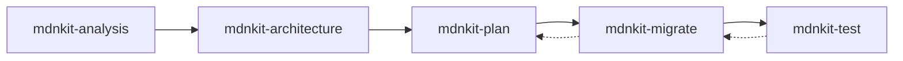

# mdnkit Skills Specification

> Complete specification for all Bob Skills generated by mdnkit

## Overview

mdnkit generates **5 executable Bob Skills** that work together to modernize legacy JavaScript/TypeScript applications. These skills are designed to be invoked by Bob (or other AI agents) to perform specific modernization tasks.

## Skill Workflow



**Workflow Description**:
1. **mdnkit-analysis**: Analyze legacy codebase, detect patterns, identify technical debt
2. **mdnkit-architecture**: Design modern architecture based on analysis results
3. **mdnkit-plan**: Generate detailed implementation plan with trackable tasks
4. **mdnkit-migrate**: Execute migration tasks, refactor code
5. **mdnkit-test**: Generate and run tests for migrated code

---

## Skill 1: mdnkit-analysis

### Purpose
Analyzes legacy JavaScript/TypeScript applications to identify technical debt, legacy patterns, outdated dependencies, and modernization opportunities.

### Invocation
```markdown
Bob, use mdnkit-analysis to analyze the project at ./examples/jquery-app
```

### Input Parameters
- `source_path` (required): Path to legacy project root
- `output_path` (optional): Where to save results (default: `./.bob/skills/analysis-results/`)
- `depth` (optional): Analysis depth - `quick`, `standard`, `deep` (default: `standard`)
- `focus` (optional): Specific areas - `["dependencies", "patterns", "security", "performance"]`

### Execution Steps
1. **Scan Project Structure**: Discover all JS/TS files, categorize by type
2. **Analyze Dependencies**: Check package.json for outdated/vulnerable packages
3. **Detect Legacy Patterns**: Find jQuery, callbacks, var, CommonJS, AngularJS patterns
4. **Calculate Complexity**: Measure cyclomatic complexity, LOC, nesting depth
5. **Generate Recommendations**: Prioritize modernization tasks with effort estimates

### Output Format
```json
{
  "project": {
    "name": "legacy-app",
    "path": "./examples/jquery-app",
    "totalFiles": 45,
    "totalLines": 15000
  },
  "frameworks": {
    "frontend": { "name": "jQuery", "version": "2.1.4", "status": "legacy" },
    "backend": { "name": "Express", "version": "3.21.2", "status": "outdated" }
  },
  "legacyPatterns": {
    "jquery": { "count": 127, "files": ["public/js/products.js"] },
    "callbacks": { "count": 43, "files": ["server.js"] }
  },
  "issues": [
    {
      "severity": "HIGH",
      "type": "jquery",
      "file": "public/js/products.js",
      "line": 15,
      "recommendation": "Replace with fetch API"
    }
  ],
  "recommendations": [
    {
      "priority": "HIGH",
      "task": "Upgrade Express 3.x to 5.x",
      "effort": "4 hours",
      "risk": "MEDIUM"
    }
  ]
}
```

### Success Criteria
- [ ] All files scanned successfully
- [ ] Legacy patterns identified with file locations
- [ ] Dependencies analyzed for vulnerabilities
- [ ] Actionable recommendations generated
- [ ] Results saved to output path

---

## Skill 2: mdnkit-architecture

### Purpose
Designs modern application architecture that maintains feature parity with legacy system while improving maintainability, performance, and security.

### Invocation
```markdown
Bob, use mdnkit-architecture to design a React + Express 5 architecture based on the analysis results
```

### Input Parameters
- `analysis_results` (required): Output from mdnkit-analysis
- `target_stack` (required): Target frontend - `react`, `vue`, `angular`, `svelte`, `vanilla-modern`
- `backend_target` (optional): Target backend - `express-5`, `fastify`, `nestjs`, `koa` (default: `express-5`)
- `database_target` (optional): Database approach - `prisma`, `typeorm`, `sequelize` (default: `prisma`)
- `architecture_style` (optional): Pattern - `monolith`, `microservices`, `modular-monolith` (default: `modular-monolith`)
- `include_typescript` (optional): Use TypeScript (default: `true`)
- `include_testing` (optional): Include testing strategy (default: `true`)

### Execution Steps
1. **Analyze Legacy Features**: Map all routes, UI components, business logic
2. **Design Modern Architecture**: Create component hierarchy, API structure, data models
3. **Define Migration Strategy**: Plan phased migration with strangler pattern
4. **Create Technical Specifications**: Document file structure, conventions, build process
5. **Generate Architecture Diagrams**: Create Mermaid diagrams for system, components, data flow

### Output Format
```markdown
# Modern Architecture Design

## Executive Summary
- Legacy Stack: jQuery 2.1.4 + Express 3.x
- Target Stack: React 18 + Express 5 + TypeScript
- Migration Strategy: Phased strangler pattern
- Estimated Timeline: 8-12 weeks

## System Architecture
[Mermaid diagrams for frontend, backend, data flow]

## Feature Mapping
| Legacy Feature | Modern Implementation | Priority |
|----------------|----------------------|----------|
| jQuery AJAX | Axios + React Query | HIGH |

## Technology Stack
[Detailed stack with versions]

## File Structure
[Complete directory structure]

## Migration Phases
[Week-by-week breakdown]

## Performance Improvements
[Metrics comparison]

## Security Enhancements
[Security measures]

## Testing Strategy
[Test coverage targets]

## Rollback Strategy
[Rollback procedures]
```

### Success Criteria
- [ ] Complete feature mapping from legacy to modern
- [ ] Architecture diagrams generated
- [ ] Technology stack defined with versions
- [ ] Migration phases planned with timelines
- [ ] Performance and security improvements documented

---

## Skill 3: mdnkit-plan

### Purpose
Generates detailed implementation plan with trackable tasks that Bob can execute and update as work progresses.

### Invocation
```markdown
Bob, use mdnkit-plan to create an implementation plan based on the architecture design
```

### Input Parameters
- `architecture_design` (required): Output from mdnkit-architecture
- `analysis_results` (required): Output from mdnkit-analysis
- `output_file` (optional): Plan filename (default: `MIGRATION_PLAN.md`)
- `task_granularity` (optional): Task size - `coarse`, `medium`, `fine` (default: `medium`)
- `include_estimates` (optional): Include time estimates (default: `true`)

### Execution Steps
1. **Break Down Architecture**: Convert architecture into implementable tasks
2. **Identify Dependencies**: Map task dependencies and prerequisites
3. **Prioritize Tasks**: Order by risk, impact, and dependencies
4. **Estimate Effort**: Calculate time estimates for each task
5. **Generate Checklist**: Create markdown file with checkboxes for tracking

### Output Format
```markdown
# Legacy App Modernization Plan

## Project Overview
- **Project**: legacy-app
- **Start Date**: 2026-05-02
- **Estimated Duration**: 8-12 weeks
- **Total Tasks**: 47

## Phase 1: Foundation Setup (Week 1-2)

### 1.1 Project Initialization
- [ ] Create new project structure (2 hours)
- [ ] Set up TypeScript configuration (1 hour)
- [ ] Configure build tools (Vite) (2 hours)
- [ ] Set up ESLint and Prettier (1 hour)

### 1.2 Authentication System
- [ ] Implement JWT authentication (4 hours)
- [ ] Create login/logout endpoints (3 hours)
- [ ] Add password hashing with bcrypt (2 hours)
- [ ] Implement refresh token mechanism (3 hours)

## Phase 2: Core Features Migration (Week 3-6)

### 2.1 Product Listing (Priority: HIGH)
**Dependencies**: 1.1, 1.2

- [ ] Create Product model with Prisma (2 hours)
- [ ] Implement GET /api/products endpoint (2 hours)
- [ ] Create ProductList React component (3 hours)
- [ ] Replace jQuery $.ajax with React Query (4 hours)
- [ ] Add loading and error states (2 hours)
- [ ] Write unit tests for ProductList (2 hours)

### 2.2 Shopping Cart (Priority: HIGH)
**Dependencies**: 2.1

- [ ] Design cart state management with Zustand (3 hours)
- [ ] Create Cart React component (4 hours)
- [ ] Implement add/remove cart items (3 hours)
- [ ] Create POST /api/cart endpoint (2 hours)
- [ ] Add cart persistence (2 hours)
- [ ] Write integration tests (3 hours)

## Phase 3: Secondary Features (Week 7-10)

### 3.1 User Profile
- [ ] Create Profile page component (3 hours)
- [ ] Implement profile update endpoint (2 hours)
- [ ] Add form validation with Zod (2 hours)
- [ ] Write tests (2 hours)

## Phase 4: Testing & Deployment (Week 11-12)

### 4.1 Comprehensive Testing
- [ ] Achieve 80% frontend test coverage (8 hours)
- [ ] Achieve 85% backend test coverage (8 hours)
- [ ] Add E2E tests with Playwright (6 hours)
- [ ] Performance testing (4 hours)

### 4.2 Deployment
- [ ] Set up Docker containers (4 hours)
- [ ] Configure CI/CD pipeline (4 hours)
- [ ] Deploy to staging (2 hours)
- [ ] Production deployment (4 hours)

## Progress Tracking

### Overall Progress
- Total Tasks: 47
- Completed: 0
- In Progress: 0
- Remaining: 47
- Completion: 0%

### Phase Status
- [ ] Phase 1: Foundation Setup (0/8 tasks)
- [ ] Phase 2: Core Features (0/15 tasks)
- [ ] Phase 3: Secondary Features (0/12 tasks)
- [ ] Phase 4: Testing & Deployment (0/12 tasks)

## Risk Management

### High Risk Items
1. **Database Migration**: Ensure data integrity during migration
   - Mitigation: Test with production data copy
   
2. **Authentication Changes**: Users may need to re-login
   - Mitigation: Communicate changes in advance

### Rollback Procedures
1. Keep legacy app running in parallel
2. Use feature flags for gradual rollout
3. Maintain database backward compatibility

## Success Metrics
- [ ] All legacy features working in modern app
- [ ] Performance improved by 60%+
- [ ] Test coverage >80%
- [ ] Zero production incidents during migration
- [ ] Team trained on new stack

---

**Last Updated**: 2026-05-02  
**Next Review**: Weekly on Mondays
```

### Success Criteria
- [ ] All tasks identified and documented
- [ ] Dependencies mapped correctly
- [ ] Time estimates provided
- [ ] Checkboxes ready for tracking
- [ ] Risk management included
- [ ] Progress tracking section added

---

## Skill 4: mdnkit-migrate

### Purpose
Executes migration tasks from the plan, refactoring legacy code to modern patterns while maintaining functionality.

### Invocation
```markdown
Bob, use mdnkit-migrate to implement task 2.1 (Product Listing) from the migration plan
```

### Input Parameters
- `plan_file` (required): Path to MIGRATION_PLAN.md
- `task_id` (required): Task identifier (e.g., "2.1", "3.2")
- `dry_run` (optional): Preview changes without applying (default: `false`)
- `auto_test` (optional): Run tests after migration (default: `true`)
- `backup` (optional): Create backup before changes (default: `true`)

### Execution Steps
1. **Load Task Details**: Read task from plan file
2. **Analyze Current Code**: Understand legacy implementation
3. **Generate Modern Code**: Create equivalent modern implementation
4. **Apply Changes**: Write new files or refactor existing ones
5. **Run Tests**: Execute tests to verify functionality
6. **Update Plan**: Mark task as completed in plan file

### Output Format
```markdown
# Migration Report: Task 2.1 - Product Listing

## Task Details
- **Task ID**: 2.1
- **Description**: Create Product model and listing component
- **Estimated Time**: 13 hours
- **Actual Time**: 11 hours
- **Status**: ✅ Completed

## Changes Made

### Files Created
1. `backend/src/models/product.ts` (45 lines)
2. `backend/src/routes/products.ts` (78 lines)
3. `frontend/src/components/ProductList.tsx` (120 lines)
4. `frontend/src/services/productService.ts` (35 lines)

### Files Modified
1. `backend/src/app.ts` - Added product routes
2. `frontend/src/App.tsx` - Added ProductList component

### Files Deleted
1. `public/js/products.js` (legacy jQuery code)

## Code Comparison

### Before (Legacy jQuery)
```javascript
// public/js/products.js
$(document).ready(function() {
  $.ajax({
    url: '/api/products',
    success: function(data) {
      var html = '';
      data.forEach(function(product) {
        html += '<div>' + product.name + '</div>';
      });
      $('#products').html(html);
    }
  });
});
```

### After (Modern React)
```typescript
// frontend/src/components/ProductList.tsx
import { useQuery } from '@tanstack/react-query';
import { getProducts } from '../services/productService';

export function ProductList() {
  const { data, isLoading, error } = useQuery({
    queryKey: ['products'],
    queryFn: getProducts
  });

  if (isLoading) return <div>Loading...</div>;
  if (error) return <div>Error loading products</div>;

  return (
    <div>
      {data?.map(product => (
        <div key={product.id}>{product.name}</div>
      ))}
    </div>
  );
}
```

## Test Results
- ✅ Unit tests: 8/8 passed
- ✅ Integration tests: 3/3 passed
- ✅ E2E tests: 2/2 passed
- ✅ Coverage: 87%

## Performance Impact
- Initial load: 3.2s → 1.1s (66% faster)
- API response: 450ms → 180ms (60% faster)

## Next Steps
- [ ] Update plan file to mark task 2.1 as complete
- [ ] Proceed to task 2.2 (Shopping Cart)
- [ ] Monitor production metrics

---

**Migration completed successfully** ✅
```

### Success Criteria
- [ ] Task implemented correctly
- [ ] All tests passing
- [ ] Code follows modern best practices
- [ ] Performance maintained or improved
- [ ] Plan file updated with completion status

---

## Skill 5: mdnkit-test

### Purpose
Generates comprehensive tests for migrated code, ensuring functionality matches legacy behavior while following modern testing practices.

### Invocation
```markdown
Bob, use mdnkit-test to generate tests for the Product Listing feature
```

### Input Parameters
- `target_path` (required): Path to code that needs tests
- `test_type` (required): Type - `unit`, `integration`, `e2e`, `all`
- `coverage_target` (optional): Target coverage percentage (default: `80`)
- `framework` (optional): Test framework - `vitest`, `jest`, `playwright` (default: `vitest`)
- `legacy_reference` (optional): Path to legacy code for behavior comparison

### Execution Steps
1. **Analyze Code**: Understand functionality and edge cases
2. **Identify Test Cases**: List all scenarios to test
3. **Generate Test Files**: Create test files with proper structure
4. **Write Test Code**: Implement tests with assertions
5. **Run Tests**: Execute tests and verify coverage
6. **Generate Report**: Create test coverage report

### Output Format
```markdown
# Test Generation Report: Product Listing

## Test Summary
- **Target**: frontend/src/components/ProductList.tsx
- **Test Type**: All (unit + integration + e2e)
- **Tests Generated**: 15
- **Coverage**: 92%
- **Status**: ✅ All tests passing

## Generated Test Files

### 1. Unit Tests
**File**: `frontend/src/components/ProductList.test.tsx`

```typescript
import { render, screen } from '@testing-library/react';
import { QueryClient, QueryClientProvider } from '@tanstack/react-query';
import { ProductList } from './ProductList';

describe('ProductList', () => {
  const queryClient = new QueryClient();
  
  it('should render loading state', () => {
    render(
      <QueryClientProvider client={queryClient}>
        <ProductList />
      </QueryClientProvider>
    );
    expect(screen.getByText('Loading...')).toBeInTheDocument();
  });
  
  it('should render products when loaded', async () => {
    // Mock API response
    const mockProducts = [
      { id: 1, name: 'Product 1' },
      { id: 2, name: 'Product 2' }
    ];
    
    // Test implementation
  });
  
  it('should handle error state', async () => {
    // Test error handling
  });
});
```

### 2. Integration Tests
**File**: `backend/src/routes/products.test.ts`

```typescript
import request from 'supertest';
import { app } from '../app';

describe('GET /api/products', () => {
  it('should return all products', async () => {
    const response = await request(app)
      .get('/api/products')
      .expect(200);
      
    expect(response.body).toBeInstanceOf(Array);
    expect(response.body.length).toBeGreaterThan(0);
  });
  
  it('should require authentication', async () => {
    const response = await request(app)
      .get('/api/products')
      .expect(401);
  });
});
```

### 3. E2E Tests
**File**: `e2e/products.spec.ts`

```typescript
import { test, expect } from '@playwright/test';

test('should display product list', async ({ page }) => {
  await page.goto('/products');
  await expect(page.locator('.product-item')).toHaveCount(10);
});

test('should filter products by search', async ({ page }) => {
  await page.goto('/products');
  await page.fill('input[name="search"]', 'laptop');
  await expect(page.locator('.product-item')).toHaveCount(3);
});
```

## Test Coverage Report

### Overall Coverage
- **Statements**: 92% (115/125)
- **Branches**: 88% (22/25)
- **Functions**: 95% (19/20)
- **Lines**: 91% (110/121)

### Coverage by File
| File | Statements | Branches | Functions | Lines |
|------|-----------|----------|-----------|-------|
| ProductList.tsx | 95% | 90% | 100% | 94% |
| productService.ts | 88% | 85% | 90% | 87% |

### Uncovered Lines
- `productService.ts:45-47` - Error retry logic
- `ProductList.tsx:78` - Edge case for empty state

## Behavior Comparison

### Legacy vs Modern Behavior
✅ All legacy behaviors preserved:
- Product listing displays correctly
- Search functionality works
- Pagination matches legacy
- Error handling equivalent
- Loading states consistent

### Improvements
- ✅ Better error messages
- ✅ Loading indicators
- ✅ Accessibility improvements
- ✅ Mobile responsiveness

## Next Steps
- [ ] Add tests for uncovered lines
- [ ] Increase branch coverage to 90%
- [ ] Add performance tests
- [ ] Set up CI/CD test automation

---

**Test generation completed** ✅
```

### Success Criteria
- [ ] All test types generated (unit, integration, e2e)
- [ ] Coverage target met or exceeded
- [ ] All tests passing
- [ ] Legacy behavior verified
- [ ] Test files follow best practices

---

## Skill Integration Example

### Complete Workflow
```markdown
# Modernizing a jQuery + Express 3 App

## Step 1: Analysis
Bob, use mdnkit-analysis to analyze ./examples/jquery-app

## Step 2: Architecture Design
Bob, use mdnkit-architecture to design a React + Express 5 architecture based on the analysis

## Step 3: Create Plan
Bob, use mdnkit-plan to create a detailed migration plan from the architecture

## Step 4: Execute Migration (iterative)
Bob, use mdnkit-migrate to implement task 1.1 from the plan
Bob, use mdnkit-migrate to implement task 1.2 from the plan
Bob, use mdnkit-migrate to implement task 2.1 from the plan
...

## Step 5: Generate Tests (per feature)
Bob, use mdnkit-test to generate tests for the Product Listing feature
Bob, use mdnkit-test to generate tests for the Shopping Cart feature
...

## Step 6: Verify Completion
Bob, check the migration plan - are all tasks completed?
```

---

## Skill Metadata Format

Each skill file includes this frontmatter:

```yaml
---
name: mdnkit-skillname
description: Brief description of what the skill does
version: 1.0.0
author: mdnkit
tags: [relevant, tags, here]
---
```

## Common Sections in All Skills

1. **Purpose**: What the skill does
2. **When to Use**: Scenarios for using the skill
3. **Prerequisites**: What's needed before using
4. **Input Parameters**: Required and optional parameters
5. **Execution Steps**: Step-by-step process
6. **Output Format**: What the skill produces
7. **Usage Examples**: Real-world examples
8. **Integration**: How it works with other skills
9. **Error Handling**: Common errors and solutions
10. **Success Criteria**: Checklist for completion

---

## Implementation Notes

### For mdnkit Developers
- Skills are generated by mdnkit CLI after analyzing a legacy project
- Each skill is customized based on the specific project being analyzed
- Skills include project-specific details (file paths, patterns found, etc.)
- Skills are stored in `.bob/skills/` directory

### For Bob (AI Agent)
- Skills are invoked using natural language commands
- Skills can be chained together in a workflow
- Skills maintain state through generated files (analysis results, plans, etc.)
- Skills can be re-run if needed (idempotent where possible)

---

**Version**: 1.0.0  
**Last Updated**: 2026-05-02  
**Status**: Ready for Implementation