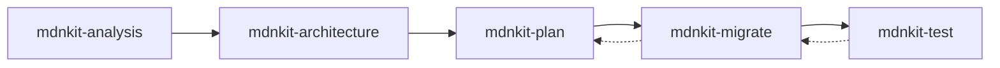

# Bob Skills Usage Guide

> How to use mdnkit-generated skills with IBM Bob

## Overview

mdnkit generates **5 executable Bob Skills** that work together to modernize legacy JavaScript/TypeScript applications. This guide explains how Bob (or other AI agents) should invoke and use these skills.

## Generated Skills

When you run `mdnkit init --source-path ./your-legacy-app`, mdnkit generates:

```
.bob/skills/
├── mdnkit-analysis/SKILL.md      # Analyze legacy codebase
├── mdnkit-architecture/SKILL.md  # Design modern architecture
├── mdnkit-plan/SKILL.md          # Create implementation plan
├── mdnkit-migrate/SKILL.md       # Execute migration tasks
└── mdnkit-test/SKILL.md          # Generate tests
```

## Skill Workflow

The skills are designed to be used in sequence:



## How to Invoke Skills

### Basic Invocation Pattern

```markdown
Bob, use <skill-name> to <action>
```

### Skill 1: mdnkit-analysis

**Purpose**: Analyze the legacy codebase to identify technical debt and modernization opportunities.

**When to Use**: 
- At the start of a modernization project
- To understand the current state of the codebase
- To identify technical debt and prioritize work

**Invocation Examples**:

```markdown
# Basic analysis
Bob, use mdnkit-analysis to analyze the legacy application

# Re-run with different depth
Bob, use mdnkit-analysis to perform a deep analysis of the codebase

# Focus on specific areas
Bob, analyze the project using mdnkit-analysis, focusing on security and dependencies
```

**What Bob Will Do**:
1. Read the skill file at `.bob/skills/mdnkit-analysis/SKILL.md`
2. Understand the project context (name, path, detected patterns)
3. Review the detected legacy patterns and issues
4. Present findings and recommendations to the user

**Expected Output**:
- Summary of detected frameworks and versions
- List of legacy patterns found (jQuery, callbacks, var, etc.)
- Critical issues with severity levels
- Prioritized recommendations

---

### Skill 2: mdnkit-architecture

**Purpose**: Design a modern application architecture that maintains feature parity while improving maintainability, performance, and security.

**When to Use**:
- After completing mdnkit-analysis
- When planning the target architecture
- To create technical specifications

**Invocation Examples**:

```markdown
# Basic architecture design
Bob, use mdnkit-architecture to design a modern architecture for this project

# Specify target stack
Bob, design a React + Express 5 architecture using mdnkit-architecture

# Request specific architecture style
Bob, use mdnkit-architecture to design a microservices architecture
```

**What Bob Will Do**:
1. Read the skill file at `.bob/skills/mdnkit-architecture/SKILL.md`
2. Review the analysis results and current architecture
3. Present the target technology stack
4. Show architecture diagrams (Mermaid)
5. Explain feature mapping from legacy to modern
6. Present migration phases

**Expected Output**:
- Target technology stack (frontend, backend, devops)
- System architecture diagrams
- Feature mapping table
- Migration phases with timelines
- Performance and security improvements

---

### Skill 3: mdnkit-plan

**Purpose**: Generate a detailed, trackable implementation plan with checkboxes for progress tracking.

**When to Use**:
- After completing mdnkit-architecture
- When you need a step-by-step migration roadmap
- To coordinate work across team members

**Invocation Examples**:

```markdown
# Generate implementation plan
Bob, use mdnkit-plan to create a detailed migration plan

# Generate with specific granularity
Bob, create a fine-grained implementation plan using mdnkit-plan

# Update existing plan
Bob, update the migration plan to mark task 1.1 as completed
```

**What Bob Will Do**:
1. Read the skill file at `.bob/skills/mdnkit-plan/SKILL.md`
2. Review architecture design and analysis results
3. Generate `MIGRATION_PLAN.md` with checkboxes
4. Break down work into phases and tasks
5. Add time estimates and dependencies
6. Include risk management section

**Expected Output**:
- `MIGRATION_PLAN.md` file with:
  - Project overview
  - Phased task breakdown
  - Checkboxes for tracking ([ ], [x], [-])
  - Progress tracking section
  - Risk management
  - Success metrics

**Plan File Format**:
```markdown
# Project Modernization Plan

## Phase 1: Foundation Setup (Week 1-2)

### 1.1 Create project structure
- [ ] Set up monorepo structure (4 hours)
- [ ] Configure TypeScript (2 hours)

### 1.2 Configure build tools
- [ ] Set up Vite (3 hours)

## Progress Tracking
- Total Tasks: 47
- Completed: 0
- In Progress: 0
- Remaining: 47
- Completion: 0%
```

---

### Skill 4: mdnkit-migrate

**Purpose**: Execute specific migration tasks from the implementation plan, refactoring legacy code to modern patterns.

**When to Use**:
- After creating the implementation plan
- To execute individual migration tasks
- To refactor specific code sections

**Invocation Examples**:

```markdown
# Execute a specific task
Bob, use mdnkit-migrate to implement task 1.1 from the migration plan

# Dry run (preview changes)
Bob, use mdnkit-migrate with dry_run=true to preview changes for task 2.3

# Execute with auto-testing
Bob, migrate task 1.2 using mdnkit-migrate and run tests automatically
```

**What Bob Will Do**:
1. Read the skill file at `.bob/skills/mdnkit-migrate/SKILL.md`
2. Load the task details from `MIGRATION_PLAN.md`
3. Analyze the current legacy code
4. Generate modern equivalent code
5. Apply changes to the codebase
6. Run tests (if auto_test=true)
7. Update the plan file to mark task as completed
8. Generate migration report

**Expected Output**:
- Migration report with:
  - Files created/modified/deleted
  - Before/after code comparison
  - Test results
  - Performance impact
  - Next steps

**Example Migration Report**:
```markdown
# Migration Report: Task 1.1 - Create project structure

## Changes Made
### Files Created
1. `frontend/package.json`
2. `backend/package.json`

### Files Modified
1. `package.json` - Added workspace configuration

## Test Results
- ✅ Unit tests: 8/8 passed
- ✅ Coverage: 87%

## Next Steps
- [ ] Update plan to mark task 1.1 as complete
- [ ] Proceed to task 1.2
```

---

### Skill 5: mdnkit-test

**Purpose**: Generate comprehensive tests for migrated code, ensuring functionality matches legacy behavior.

**When to Use**:
- After migrating code with mdnkit-migrate
- Before starting migration (to establish baseline)
- To achieve target test coverage

**Invocation Examples**:

```markdown
# Generate all tests
Bob, use mdnkit-test to generate tests for the ProductList component

# Generate specific test type
Bob, generate unit tests for src/components using mdnkit-test

# Increase coverage
Bob, use mdnkit-test to add tests for uncovered lines in src/utils.ts

# Compare with legacy behavior
Bob, generate tests using mdnkit-test with legacy_reference=./legacy/products.js
```

**What Bob Will Do**:
1. Read the skill file at `.bob/skills/mdnkit-test/SKILL.md`
2. Analyze the target code
3. Identify test cases (happy path, edge cases, errors)
4. Generate test files (unit, integration, e2e)
5. Run tests and measure coverage
6. Generate test report

**Expected Output**:
- Test files generated:
  - `*.test.ts` (unit tests)
  - `*.spec.ts` (integration tests)
  - `*.e2e.ts` (e2e tests)
- Test coverage report
- Behavior comparison with legacy
- Suggestions for additional tests

---

## Skill Chaining Patterns

### Pattern 1: Complete Modernization Workflow

```markdown
# Step 1: Analyze
Bob, use mdnkit-analysis to analyze the legacy application

# Step 2: Design
Bob, use mdnkit-architecture to design a React + Express 5 architecture

# Step 3: Plan
Bob, use mdnkit-plan to create a detailed implementation plan

# Step 4: Migrate (iterative)
Bob, use mdnkit-migrate to implement task 1.1
Bob, use mdnkit-migrate to implement task 1.2
Bob, use mdnkit-migrate to implement task 2.1
...

# Step 5: Test (per feature)
Bob, use mdnkit-test to generate tests for the migrated ProductList
Bob, use mdnkit-test to generate tests for the ShoppingCart
...

# Step 6: Verify
Bob, check the migration plan - are all tasks completed?
```

### Pattern 2: Iterative Development

```markdown
# Analyze → Design → Plan
Bob, analyze the app with mdnkit-analysis, then design architecture with mdnkit-architecture, then create a plan with mdnkit-plan

# Migrate → Test → Update Plan (repeat)
Bob, migrate task 1.1 with mdnkit-migrate, then generate tests with mdnkit-test, then update the plan

# Continue iteration
Bob, what's the next task in the migration plan?
Bob, migrate the next task and generate tests
```

### Pattern 3: Focused Refactoring

```markdown
# Analyze specific area
Bob, use mdnkit-analysis to analyze the authentication module

# Design solution
Bob, design a modern authentication architecture using mdnkit-architecture

# Implement
Bob, create a plan for auth migration with mdnkit-plan
Bob, migrate the auth tasks with mdnkit-migrate
Bob, generate auth tests with mdnkit-test
```

---

## Skill Parameters

### mdnkit-analysis Parameters

| Parameter | Type | Required | Default | Description |
|-----------|------|----------|---------|-------------|
| source_path | string | Yes | - | Path to legacy project |
| output_path | string | No | `./.bob/skills/analysis-results/` | Output directory |
| depth | string | No | `standard` | Analysis depth: `quick`, `standard`, `deep` |
| focus | array | No | All | Focus areas: `dependencies`, `patterns`, `security`, `performance` |

### mdnkit-architecture Parameters

| Parameter | Type | Required | Default | Description |
|-----------|------|----------|---------|-------------|
| analysis_results | object | Yes | - | Output from mdnkit-analysis |
| target_stack | string | Yes | - | Target framework: `react`, `vue`, `angular`, `svelte` |
| backend_target | string | No | `express-5` | Backend: `express-5`, `fastify`, `nestjs`, `koa` |
| architecture_style | string | No | `modular-monolith` | Style: `monolith`, `microservices`, `modular-monolith` |
| include_typescript | boolean | No | `true` | Use TypeScript |

### mdnkit-plan Parameters

| Parameter | Type | Required | Default | Description |
|-----------|------|----------|---------|-------------|
| architecture_design | object | Yes | - | Output from mdnkit-architecture |
| analysis_results | object | Yes | - | Output from mdnkit-analysis |
| output_file | string | No | `MIGRATION_PLAN.md` | Plan filename |
| task_granularity | string | No | `medium` | Task size: `coarse`, `medium`, `fine` |

### mdnkit-migrate Parameters

| Parameter | Type | Required | Default | Description |
|-----------|------|----------|---------|-------------|
| plan_file | string | Yes | - | Path to MIGRATION_PLAN.md |
| task_id | string | Yes | - | Task ID (e.g., "1.1", "2.3") |
| dry_run | boolean | No | `false` | Preview without applying |
| auto_test | boolean | No | `true` | Run tests after migration |
| backup | boolean | No | `true` | Create backup before changes |

### mdnkit-test Parameters

| Parameter | Type | Required | Default | Description |
|-----------|------|----------|---------|-------------|
| target_path | string | Yes | - | Path to code needing tests |
| test_type | string | Yes | - | Type: `unit`, `integration`, `e2e`, `all` |
| coverage_target | number | No | `80` | Target coverage percentage |
| framework | string | No | `vitest` | Test framework: `vitest`, `jest`, `playwright` |
| legacy_reference | string | No | - | Path to legacy code for comparison |

---

## Best Practices

### 1. Always Start with Analysis
```markdown
# ✅ Good
Bob, use mdnkit-analysis to analyze the project
Bob, use mdnkit-architecture to design the architecture

# ❌ Bad
Bob, use mdnkit-architecture to design the architecture
# (No analysis done first)
```

### 2. Review Before Proceeding
```markdown
# ✅ Good
Bob, use mdnkit-analysis to analyze the project
# Review the analysis results
Bob, use mdnkit-architecture to design based on the analysis

# ❌ Bad
Bob, analyze with mdnkit-analysis and immediately design with mdnkit-architecture
# (No time to review)
```

### 3. Update Plan Regularly
```markdown
# ✅ Good
Bob, migrate task 1.1 with mdnkit-migrate
Bob, update the migration plan to mark task 1.1 as completed
Bob, what's the next task?

# ❌ Bad
Bob, migrate all tasks without updating the plan
# (Lose track of progress)
```

### 4. Test After Each Migration
```markdown
# ✅ Good
Bob, migrate task 2.1 with mdnkit-migrate
Bob, generate tests for the migrated code with mdnkit-test

# ❌ Bad
Bob, migrate all tasks, then generate tests at the end
# (Hard to debug issues)
```

### 5. Use Dry Run for Complex Changes
```markdown
# ✅ Good
Bob, use mdnkit-migrate with dry_run=true to preview task 3.5
# Review the preview
Bob, proceed with the migration

# ❌ Bad
Bob, migrate task 3.5 directly
# (No preview of complex changes)
```

---

## Troubleshooting

### Issue: Skill Not Found
**Problem**: Bob says "I can't find the mdnkit-analysis skill"

**Solution**:
1. Verify skills were generated: `ls .bob/skills/`
2. Check skill file exists: `cat .bob/skills/mdnkit-analysis/SKILL.md`
3. Re-run mdnkit: `mdnkit init --source-path ./your-app`

### Issue: Outdated Skill Data
**Problem**: Skill shows old project data

**Solution**:
1. Re-run mdnkit to regenerate skills
2. Delete old skills: `rm -rf .bob/skills/`
3. Generate fresh skills: `mdnkit init --source-path ./your-app`

### Issue: Migration Task Fails
**Problem**: mdnkit-migrate fails to complete a task

**Solution**:
1. Check task dependencies are completed
2. Review error messages in migration report
3. Use dry_run to preview changes first
4. Fix issues manually if needed
5. Update plan to reflect actual state

### Issue: Low Test Coverage
**Problem**: mdnkit-test generates tests but coverage is low

**Solution**:
1. Use mdnkit-test to add tests for uncovered lines
2. Review uncovered lines in coverage report
3. Generate additional test cases manually
4. Re-run coverage measurement

---

## Advanced Usage

### Custom Skill Invocation
```markdown
# Combine multiple skills in one request
Bob, analyze the project with mdnkit-analysis, design architecture with mdnkit-architecture, and create a plan with mdnkit-plan

# Conditional execution
Bob, if the analysis shows jQuery usage, design a React migration with mdnkit-architecture

# Parameterized invocation
Bob, use mdnkit-analysis with depth=deep and focus=["security", "performance"]
```

### Skill Composition
```markdown
# Create a custom workflow
Bob, create a modernization workflow:
1. Analyze with mdnkit-analysis
2. If legacy patterns found, design with mdnkit-architecture
3. Create plan with mdnkit-plan
4. Execute first 3 tasks with mdnkit-migrate
5. Generate tests with mdnkit-test
```

---

## FAQ

**Q: Can I modify the generated skills?**  
A: Yes, but regenerating will overwrite changes. Better to provide feedback to improve templates.

**Q: Can I use skills with other AI agents?**  
A: Yes! Skills follow a standard format that any AI agent can understand.

**Q: How do I share skills with my team?**  
A: Commit `.bob/skills/` to version control. Team members can use the same skills.

**Q: Can I generate skills for multiple projects?**  
A: Yes, use different output directories:
```bash
mdnkit init --source-path ./project1 --output-dir ./project1/.bob/skills
mdnkit init --source-path ./project2 --output-dir ./project2/.bob/skills
```

**Q: How do I know which task to migrate next?**  
A: Check the migration plan:
```markdown
Bob, what's the next pending task in the migration plan?
```

---

## Resources

- [Skills Specification](./SKILLS_SPECIFICATION.md) - Detailed skill specifications
- [Implementation Roadmap](./IMPLEMENTATION_ROADMAP.md) - Development roadmap
- [Architecture](./ARCHITECTURE.md) - System architecture
- [README](../README.md) - Getting started guide

---

**Version**: 1.0.0  
**Last Updated**: 2026-05-02  
**Status**: Production Ready