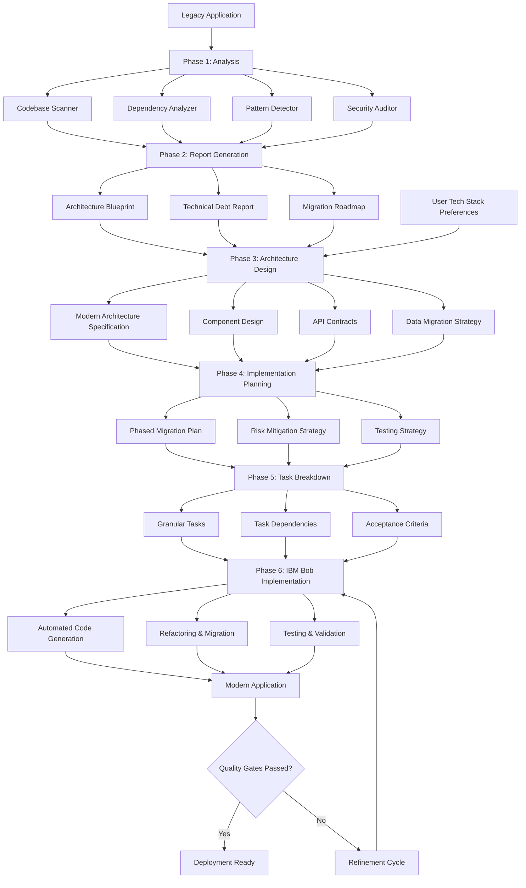

# mdnkit Technical Reference

> **Detailed technical documentation for mdnkit implementation**

This document contains the detailed technical specifications, architecture details, and implementation guidelines for building mdnkit. Use this as a reference during development.

---

## Table of Contents

1. [Modernization Workflow](#modernization-workflow)
2. [Phase Details](#phase-details)
3. [Bob Skills Structure](#bob-skills-structure)
4. [Configuration & Customization](#configuration--customization)
5. [IBM Bob Integration](#ibm-bob-integration)
6. [Use Cases & Examples](#use-cases--examples)
7. [Roadmap](#roadmap)

---

## Modernization Workflow

mdnkit follows a systematic, six-phase approach to application modernization, culminating in the generation of Bob Skills markdown files that guide IBM Bob through implementation:



---

## Phase Details

### Phase 1: Analysis 🔍

The analysis engine performs a comprehensive examination of your legacy application and generates `.bob/skills/analysis/SKILL.md`:

- **Code Structure Analysis**: Maps the entire codebase structure, identifying modules, components, and their relationships
- **Dependency Mapping**: Traces all internal and external dependencies, including libraries, frameworks, and services
- **Pattern Recognition**: Identifies design patterns, architectural styles, and common code patterns
- **Technical Debt Assessment**: Evaluates code quality, complexity, duplication, and maintainability issues
- **Security Audit**: Scans for known vulnerabilities, outdated dependencies, and security anti-patterns
- **Performance Profiling**: Identifies performance bottlenecks and resource-intensive operations
- **Database Schema Analysis**: Maps database structures, relationships, and query patterns

**Supported Legacy Technologies:**
- PHP (5.x - 7.x) applications
- JSP/Servlet-based Java web applications
- ASP.NET Framework (WebForms, MVC)
- Legacy JavaScript frameworks (jQuery, Backbone.js, AngularJS 1.x)
- Classic ASP applications
- Monolithic web applications with mixed technologies

### Phase 2: Report Generation 📊

mdnkit generates comprehensive documentation that serves as your modernization blueprint:

- **Executive Summary**: High-level overview of findings and recommendations
- **Current State Architecture**: Visual diagrams of existing architecture and data flows
- **Technical Debt Report**: Detailed breakdown of issues, risks, and their impact
- **Dependency Graph**: Visual representation of all dependencies and their relationships
- **Modernization Opportunities**: Identified areas for improvement and optimization
- **Technology Stack Recommendations**: Suggested modern alternatives based on your requirements
- **Risk Assessment Matrix**: Evaluation of migration risks and mitigation strategies
- **Effort Estimation**: Projected timeline and resource requirements
- **Reference Documentation**: Detailed code documentation for future reference

### Phase 3: Architecture Design 🏗️

Design a modern architecture tailored to your specific needs and preferences, documented in `.bob/skills/architecture-design/SKILL.md`:

- **User-Driven Tech Stack Selection**: Choose your preferred modern technologies
  - Frontend: React, Vue.js, Angular, Next.js, Svelte, etc.
  - Backend: Node.js, Python (Django/FastAPI), Java (Spring Boot), .NET Core, Go, etc.
  - Database: PostgreSQL, MySQL, MongoDB, Redis, etc.
  - Infrastructure: Docker, Kubernetes, AWS, Azure, GCP, etc.

- **Architecture Patterns**: Select from proven patterns
  - Microservices architecture
  - Serverless/FaaS
  - API-first design
  - Event-driven architecture
  - Modular monolith
  - Jamstack

- **Component Design**: Define modern application components
  - Frontend components and state management
  - Backend services and APIs
  - Data access layers
  - Authentication and authorization
  - Caching strategies
  - Message queues and event buses

- **API Specifications**: Design RESTful or GraphQL APIs
- **Data Migration Strategy**: Plan database schema evolution and data transformation
- **Infrastructure as Code**: Define deployment and infrastructure requirements

### Phase 4: Implementation Planning 📝

Create a solid, executable plan for the modernization journey, captured in `.bob/skills/implementation-plan/SKILL.md`:

- **Phased Migration Strategy**: Break the modernization into manageable phases
  - Phase prioritization based on business value and risk
  - Parallel development opportunities
  - Incremental rollout strategies
  - Feature flag implementation

- **Risk Mitigation Plans**: Address potential challenges proactively
  - Rollback procedures
  - Data backup and recovery strategies
  - Performance monitoring plans
  - Security validation checkpoints

- **Testing Strategy**: Ensure quality throughout migration
  - Unit testing approach
  - Integration testing plans
  - End-to-end testing scenarios
  - Performance testing benchmarks
  - User acceptance testing criteria

- **Resource Planning**: Define team requirements and timelines
- **Communication Plan**: Stakeholder updates and milestone reporting

### Phase 5: Task Breakdown 🎯

Transform high-level plans into actionable, IBM Bob-ready tasks, documented in `.bob/skills/tasks/SKILL.md`:

- **Granular Task Decomposition**: Break down each phase into specific, executable tasks
  - Clear task descriptions and objectives
  - Detailed technical specifications
  - Input requirements and expected outputs
  - Estimated effort and complexity

- **Dependency Management**: Establish task relationships and sequencing
  - Prerequisite identification
  - Parallel execution opportunities
  - Critical path analysis

- **Acceptance Criteria**: Define success metrics for each task
  - Functional requirements
  - Performance benchmarks
  - Code quality standards
  - Test coverage requirements

- **Priority Assignment**: Order tasks by business value and dependencies
- **Validation Checkpoints**: Define review and approval gates

### Phase 6: IBM Bob Implementation 🤖

Hand off tasks to IBM Bob for automated implementation:

- **Automated Code Generation**: IBM Bob generates modern code based on specifications
- **Intelligent Refactoring**: Transform legacy patterns into modern equivalents
- **Test Creation**: Generate comprehensive test suites
- **Documentation**: Auto-generate code documentation and API specs
- **Continuous Validation**: Automated testing and quality checks
- **Iterative Refinement**: Human review and feedback loops
- **Progress Tracking**: Real-time monitoring of implementation status

---

## Bob Skills Structure

After running `mdnkit init`, the following directory structure is created in your project:

```
.bob/
└── skills/
    ├── analysis/
    │   └── SKILL.md                    # Legacy codebase analysis
    ├── architecture-design/
    │   └── SKILL.md                    # Modern architecture specification
    ├── implementation-plan/
    │   └── SKILL.md                    # Migration strategy and roadmap
    └── tasks/
        └── SKILL.md                    # Granular implementation tasks
```

### What's in Each SKILL.md File?

#### 1. **analysis/SKILL.md**
Contains comprehensive analysis of your legacy application:
- Code structure and organization
- Technology stack identification
- Dependency mapping
- Security vulnerabilities
- Technical debt assessment
- Performance bottlenecks
- Database schema analysis

#### 2. **architecture-design/SKILL.md**
Defines the target modern architecture:
- Recommended tech stack
- Architecture patterns (microservices, API-first, etc.)
- Component design specifications
- API contracts and interfaces
- Data migration strategies
- Infrastructure requirements

#### 3. **implementation-plan/SKILL.md**
Provides the migration roadmap:
- Phased migration strategy
- Risk mitigation plans
- Testing strategies
- Resource requirements
- Timeline projections
- Rollback procedures

#### 4. **tasks/SKILL.md**
Lists granular, actionable tasks for IBM Bob:
- Detailed task descriptions
- Task dependencies and sequencing
- Acceptance criteria
- Priority assignments
- Estimated effort
- Validation checkpoints

### How IBM Bob Uses These Skills

IBM Bob reads the SKILL.md files in sequence and uses them as a comprehensive guide for implementing the modernization:

1. **Understanding Context**: Bob reads `analysis/SKILL.md` to understand the legacy application
2. **Planning Architecture**: Bob reviews `architecture-design/SKILL.md` for the target design
3. **Following Strategy**: Bob uses `implementation-plan/SKILL.md` for the migration approach
4. **Executing Tasks**: Bob implements each task from `tasks/SKILL.md` systematically

This structured approach ensures that Bob has all the necessary context and guidance to perform the modernization accurately and efficiently.

---

## Configuration & Customization

### Configuration File

Create a `mdnkit.config.json` in your project root for advanced customization:

```json
{
  "project": {
    "name": "MyLegacyApp",
    "sourcePath": "./legacy-app",
    "outputPath": "./.bob/skills"
  },
  "analysis": {
    "depth": "comprehensive",
    "includeTests": true,
    "scanDependencies": true,
    "securityAudit": true,
    "performanceProfile": true
  },
  "targetArchitecture": {
    "frontend": {
      "framework": "React",
      "stateManagement": "Redux Toolkit",
      "styling": "Tailwind CSS",
      "buildTool": "Vite"
    },
    "backend": {
      "runtime": "Node.js",
      "framework": "Express",
      "language": "TypeScript",
      "orm": "Prisma"
    },
    "database": {
      "type": "PostgreSQL",
      "version": "15"
    },
    "infrastructure": {
      "containerization": "Docker",
      "orchestration": "Kubernetes",
      "cloud": "AWS"
    }
  },
  "migration": {
    "strategy": "phased",
    "parallelDevelopment": true,
    "featureFlags": true,
    "rollbackStrategy": "blue-green"
  },
  "bobIntegration": {
    "skillsPath": "./.bob/skills",
    "autoGenerate": true,
    "reviewRequired": true,
    "testingLevel": "comprehensive"
  }
}
```

### Customizing Analysis Depth

```bash
# Quick analysis (structure and dependencies only)
mdnkit init --source-path "/path/to/app" --depth quick

# Standard analysis (includes patterns and basic security)
mdnkit init --source-path "/path/to/app" --depth standard

# Comprehensive analysis (full audit including performance)
mdnkit init --source-path "/path/to/app" --depth comprehensive
```

### Specifying Tech Stack via CLI

```bash
mdnkit init --source-path "/path/to/app" \
  --frontend react \
  --backend nodejs \
  --database postgresql \
  --architecture microservices
```

---

## IBM Bob Integration

mdnkit is designed to work seamlessly with IBM Bob, creating a powerful AI-driven modernization pipeline.

### How It Works

1. **Task Specification**: mdnkit generates detailed task specifications in a format optimized for IBM Bob
2. **Context Preservation**: All analysis reports and architecture designs are included as context for Bob
3. **Incremental Handoff**: Tasks are handed off in dependency order, ensuring Bob has all necessary context
4. **Validation Gates**: Human review checkpoints ensure quality and alignment with business requirements
5. **Feedback Loop**: Bob's implementation results feed back into the planning system for continuous improvement

### Task Format for IBM Bob

Each task handed to Bob includes:

```json
{
  "taskId": "TASK-001",
  "title": "Create User Authentication Service",
  "description": "Implement JWT-based authentication service using Express and Passport.js",
  "context": {
    "legacyImplementation": "Reference to legacy auth code",
    "architectureSpec": "Link to architecture design document",
    "dependencies": ["TASK-000"]
  },
  "requirements": {
    "functional": ["User login", "Token generation", "Token validation"],
    "technical": ["TypeScript", "Express", "JWT", "bcrypt"],
    "performance": ["Response time < 200ms", "Support 1000 concurrent users"],
    "security": ["Password hashing", "Token expiration", "Rate limiting"]
  },
  "acceptanceCriteria": [
    "All unit tests pass with >90% coverage",
    "Integration tests validate token flow",
    "Security scan shows no vulnerabilities",
    "API documentation is complete"
  ],
  "estimatedEffort": "4 hours",
  "priority": "high"
}
```

---

## Use Cases & Examples

### Example 1: Modernizing a Legacy PHP E-commerce Application

**Legacy Stack**: PHP 5.6, MySQL, jQuery, Apache

**Target Stack**: Next.js, Node.js, PostgreSQL, Docker, AWS

**Modernization Approach**:
1. Analyze the monolithic PHP application
2. Identify core business logic and data models
3. Design microservices architecture with API gateway
4. Plan phased migration starting with product catalog
5. Generate tasks for Bob to implement new services
6. Gradually migrate features while maintaining legacy system
7. Implement feature flags for gradual rollout

**Timeline**: 12 weeks with 3-person team + IBM Bob

### Example 2: Migrating JSP Application to React SPA

**Legacy Stack**: Java JSP/Servlets, Oracle DB, Struts, Tomcat

**Target Stack**: React, Spring Boot, PostgreSQL, Kubernetes

**Modernization Approach**:
1. Extract business logic from JSP pages
2. Design RESTful API layer with Spring Boot
3. Create React components matching existing UI
4. Implement state management with Redux
5. Migrate database schema to PostgreSQL
6. Containerize services with Docker
7. Deploy to Kubernetes cluster

**Timeline**: 16 weeks with 4-person team + IBM Bob

### Example 3: ASP.NET WebForms to Modern .NET Core

**Legacy Stack**: ASP.NET WebForms, SQL Server, jQuery

**Target Stack**: .NET 8, Blazor, Azure SQL, Azure App Service

**Modernization Approach**:
1. Analyze WebForms page lifecycle and ViewState usage
2. Design component-based architecture with Blazor
3. Refactor code-behind logic to clean services
4. Implement modern authentication with Identity
5. Optimize database queries and add caching
6. Create CI/CD pipeline with Azure DevOps
7. Deploy to Azure with auto-scaling

**Timeline**: 10 weeks with 3-person team + IBM Bob

---

## Roadmap

### Current Version (v1.0)
- ✅ Legacy codebase analysis for PHP, JSP, ASP.NET
- ✅ Comprehensive report generation
- ✅ Interactive architecture design
- ✅ Implementation planning and task breakdown
- ✅ IBM Bob integration

### Upcoming Features (v1.1)
- 🔄 Support for Python (Django/Flask) legacy applications
- 🔄 AI-powered code pattern recognition
- 🔄 Automated test generation from legacy tests
- 🔄 Real-time collaboration features
- 🔄 Cloud cost estimation

### Future Enhancements (v2.0)
- 📋 Support for mainframe and COBOL modernization
- 📋 Machine learning-based effort estimation
- 📋 Automated performance optimization suggestions
- 📋 Integration with popular project management tools
- 📋 Multi-language support for reports

---

**Last Updated**: 2026-05-02