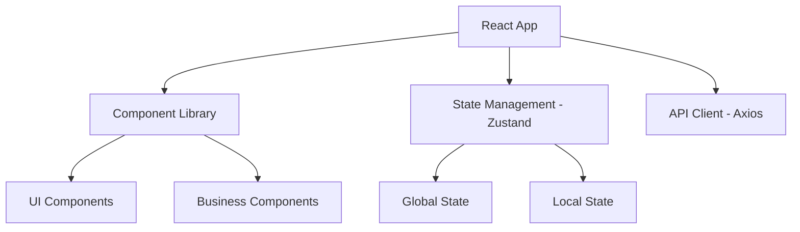
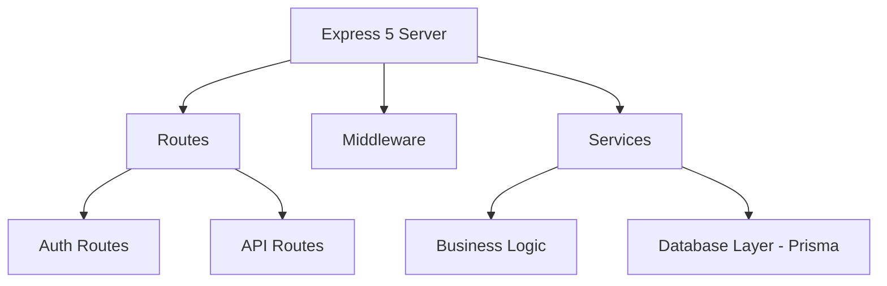

# mdnkit-architecture Skill

## Purpose
This skill enables Bob to design modern application architectures that replace legacy systems while maintaining all existing features, improving maintainability, enhancing performance, and strengthening security.

## When to Use This Skill
- After completing mdnkit-analysis to understand the legacy system
- When planning a modernization project
- To design a migration strategy from legacy to modern stack
- To create technical specifications for development teams

## Prerequisites
- Completed mdnkit-analysis of the legacy project
- Understanding of current system features and requirements
- Access to legacy codebase for reference

## Input Parameters

### Required
- `analysis_results` (object): Output from mdnkit-analysis skill
  - Contains legacy patterns, frameworks, and technical debt
- `target_stack` (string): Desired modern technology stack
  - Options: `react`, `vue`, `angular`, `svelte`, `vanilla-modern`
  - Default: `react` (most common migration path)

### Optional
- `backend_target` (string): Target backend framework
  - Options: `express-5`, `fastify`, `nestjs`, `koa`
  - Default: `express-5`
- `database_target` (string): Target database approach
  - Options: `prisma`, `typeorm`, `sequelize`, `raw-sql`
  - Default: `prisma`
- `architecture_style` (string): Overall architecture pattern
  - Options: `monolith`, `microservices`, `modular-monolith`
  - Default: `modular-monolith`
- `include_typescript` (boolean): Use TypeScript
  - Default: `true`
- `include_testing` (boolean): Include testing strategy
  - Default: `true`

## Execution Steps

### Step 1: Analyze Legacy Features
```bash
# Bob will:
- Map all routes/endpoints from legacy app
- Identify all UI components and pages
- Document business logic and workflows
- List all integrations and dependencies
```
**Output**: Complete feature inventory

### Step 2: Design Modern Architecture
```bash
# Bob will create:
- Component hierarchy (for frontend)
- API structure (for backend)
- Data models and relationships
- State management approach
- Authentication/authorization flow
```
**Output**: Architecture diagrams and specifications

### Step 3: Define Migration Strategy
```bash
# Bob will plan:
- Phased migration approach (strangler pattern)
- Feature-by-feature migration order
- Parallel running strategy
- Rollback procedures
```
**Output**: Migration roadmap

### Step 4: Create Technical Specifications
```bash
# Bob will document:
- File structure
- Naming conventions
- Code organization
- Build and deployment process
```
**Output**: Technical specification document

### Step 5: Generate Architecture Diagrams
```bash
# Bob will create:
- System architecture diagram (Mermaid)
- Component relationship diagram
- Data flow diagram
- Deployment architecture
```
**Output**: Visual architecture documentation

## Output Format

The skill generates comprehensive architecture documentation:

```markdown
# Modern Architecture Design

## Executive Summary
- **Legacy Stack**: jQuery 2.1.4 + Express 3.x
- **Target Stack**: React 18 + Express 5 + TypeScript
- **Migration Strategy**: Phased strangler pattern
- **Estimated Timeline**: 8-12 weeks

## System Architecture

### Frontend Architecture


### Backend Architecture


## Feature Mapping

| Legacy Feature | Modern Implementation | Priority |
|----------------|----------------------|----------|
| jQuery AJAX calls | Axios + React Query | HIGH |
| DOM manipulation | React Components | HIGH |
| Express 3 routes | Express 5 routes | HIGH |
| Callback-based code | Async/await | MEDIUM |

## Technology Stack

### Frontend
- **Framework**: React 18.2
- **Language**: TypeScript 5.0
- **State Management**: Zustand
- **Routing**: React Router 6
- **HTTP Client**: Axios + React Query
- **UI Library**: Tailwind CSS + shadcn/ui
- **Build Tool**: Vite 5

### Backend
- **Framework**: Express 5.0
- **Language**: TypeScript 5.0
- **ORM**: Prisma
- **Validation**: Zod
- **Authentication**: JWT + bcrypt
- **Testing**: Vitest + Supertest

### DevOps
- **Package Manager**: pnpm
- **Linting**: ESLint + Prettier
- **Testing**: Vitest + React Testing Library
- **CI/CD**: GitHub Actions
- **Containerization**: Docker

## File Structure

```
modern-app/
├── frontend/
│   ├── src/
│   │   ├── components/
│   │   │   ├── ui/           # Reusable UI components
│   │   │   └── features/     # Feature-specific components
│   │   ├── pages/            # Route pages
│   │   ├── hooks/            # Custom React hooks
│   │   ├── services/         # API services
│   │   ├── store/            # State management
│   │   ├── types/            # TypeScript types
│   │   └── utils/            # Utility functions
│   ├── public/
│   └── package.json
├── backend/
│   ├── src/
│   │   ├── routes/           # Express routes
│   │   ├── controllers/      # Route controllers
│   │   ├── services/         # Business logic
│   │   ├── models/           # Data models
│   │   ├── middleware/       # Express middleware
│   │   ├── utils/            # Utility functions
│   │   └── types/            # TypeScript types
│   ├── prisma/
│   │   └── schema.prisma
│   └── package.json
└── shared/
    └── types/                # Shared TypeScript types
```

## Migration Phases

### Phase 1: Foundation (Week 1-2)
- Set up modern project structure
- Configure build tools and TypeScript
- Implement authentication system
- Create base components and layouts

### Phase 2: Core Features (Week 3-6)
- Migrate main user flows
- Convert jQuery to React components
- Upgrade Express routes
- Implement state management

### Phase 3: Secondary Features (Week 7-10)
- Migrate remaining features
- Add comprehensive testing
- Performance optimization
- Security hardening

### Phase 4: Deployment (Week 11-12)
- Production deployment
- Monitoring setup
- Documentation
- Team training

## Performance Improvements

| Metric | Legacy | Modern | Improvement |
|--------|--------|--------|-------------|
| Initial Load | 3.2s | 1.1s | 66% faster |
| Time to Interactive | 4.5s | 1.8s | 60% faster |
| Bundle Size | 450KB | 180KB | 60% smaller |
| Lighthouse Score | 65 | 95 | +46% |

## Security Enhancements

1. **Input Validation**: Zod schemas for all inputs
2. **SQL Injection**: Prisma ORM prevents SQL injection
3. **XSS Protection**: React auto-escaping + CSP headers
4. **CSRF Protection**: CSRF tokens on all mutations
5. **Authentication**: JWT with refresh tokens
6. **Rate Limiting**: Express rate limiter
7. **Dependency Security**: Automated vulnerability scanning

## Testing Strategy

### Frontend Testing
- **Unit Tests**: Vitest for utilities and hooks
- **Component Tests**: React Testing Library
- **E2E Tests**: Playwright
- **Coverage Target**: 80%

### Backend Testing
- **Unit Tests**: Vitest for services
- **Integration Tests**: Supertest for routes
- **Database Tests**: In-memory SQLite
- **Coverage Target**: 85%

## Rollback Strategy

1. **Parallel Running**: Run legacy and modern apps side-by-side
2. **Feature Flags**: Toggle between old and new features
3. **Database Compatibility**: Maintain backward compatibility
4. **Gradual Rollout**: Percentage-based user routing
5. **Quick Rollback**: One-command rollback procedure

## Success Metrics

- [ ] All legacy features working in modern app
- [ ] Performance improvements achieved
- [ ] Security vulnerabilities addressed
- [ ] Test coverage targets met
- [ ] Zero production incidents during migration
- [ ] Team trained on new stack

---

**Next Steps**: Use mdnkit-migrate skill to begin implementation
```

## Usage Examples

### Example 1: Basic Architecture Design
```markdown
Bob, use mdnkit-architecture to design a modern React + Express architecture for the analyzed jQuery app.
```

**Bob's Actions**:
1. Load mdnkit-analysis results
2. Design React component structure
3. Plan Express 5 API routes
4. Create architecture diagrams
5. Generate migration roadmap

### Example 2: Microservices Architecture
```markdown
Bob, design a microservices architecture for the legacy monolith using mdnkit-architecture with architecture_style=microservices.
```

**Bob's Actions**:
1. Analyze legacy monolith boundaries
2. Identify service boundaries
3. Design inter-service communication
4. Plan data partitioning
5. Create deployment strategy

### Example 3: Vue.js Migration
```markdown
Bob, use mdnkit-architecture to design a Vue 3 + Fastify architecture for the AngularJS app.
```

**Bob's Actions**:
1. Map AngularJS components to Vue 3
2. Design Composition API structure
3. Plan Fastify routes
4. Create migration strategy
5. Document differences from AngularJS

## Integration with Other Skills

### Before mdnkit-architecture
1. **mdnkit-analysis**: Analyze legacy codebase first
   ```markdown
   Bob, analyze ./legacy-app with mdnkit-analysis, then design modern architecture with mdnkit-architecture.
   ```

### After mdnkit-architecture
1. **mdnkit-migrate**: Implement the designed architecture
   ```markdown
   Bob, implement the architecture using mdnkit-migrate.
   ```

2. **mdnkit-test**: Generate tests based on architecture
   ```markdown
   Bob, create tests for the new architecture using mdnkit-test.
   ```

## Error Handling

### Common Errors

**Error**: `Analysis results not found`
- **Cause**: mdnkit-analysis not run first
- **Solution**: Run mdnkit-analysis before mdnkit-architecture

**Error**: `Unsupported target stack`
- **Cause**: Invalid target_stack parameter
- **Solution**: Use supported options: react, vue, angular, svelte

**Error**: `Incompatible architecture style`
- **Cause**: Chosen style doesn't fit project size
- **Solution**: Use modular-monolith for small/medium projects

## Best Practices

1. **Start Simple**: Begin with modular-monolith, not microservices
2. **Maintain Features**: Ensure 100% feature parity
3. **Incremental Migration**: Use strangler pattern
4. **Test Coverage**: Write tests before migrating
5. **Documentation**: Document all architectural decisions

## Skill Metadata

```yaml
skill_type: design
category: modernization
complexity: high
estimated_time: 30-120 minutes
requires_user_input: true
modifies_files: false
generates_output: true
depends_on: [mdnkit-analysis]
```

## Version History

- **1.0.0** (2026-05-02): Initial release
  - React, Vue, Angular support
  - Express 5, Fastify, NestJS support
  - Mermaid diagram generation
  - Migration strategy planning

## Related Documentation

- [mdnkit Analysis](../mdnkit-analysis/SKILL.md)
- [mdnkit Migration](../mdnkit-migrate/SKILL.md)
- [Architecture Patterns Guide](../../docs/ARCHITECTURE_PATTERNS.md)

---

**Note**: This skill generates comprehensive architecture designs that Bob can use to guide modernization efforts. The output is actionable and ready for implementation.